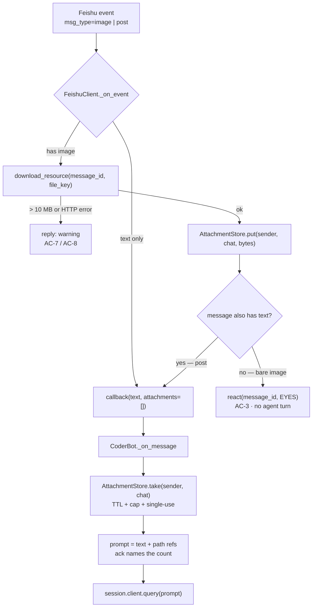

# Design: messaging/image-input

> Owner: Architect · Status: approved
> Spec: `docs/sdlc/specs/messaging/image-input.md` · Targets spec version: `h1:b82962101050`

## Summary  <!-- Context -->

A Feishu `image` message (or an image inside a `post`) is downloaded to a host-side attachment
directory outside every project tree, held against `(sender, chat)` with a TTL, and referenced **by
file path** in the sender's next prompt so the agent's own `Read` tool ingests it. Receipt is
acknowledged with an emoji reaction rather than a reply. Nothing about the transport, the session key,
or the SDK engine changes; the message-event path widens from `text: str` to `text + attachments`.

## System constraints  <!-- Contract -->

- *ADR-0003: Feishu `lark-oapi` WebSocket transport → inbound stays the long-connection event path; the
  resource download is an **outbound** REST call like every existing reply, so no inbound server is
  introduced and the ADR's revisit triggers stay untripped.*
- *ADR-0004: Claude Agent SDK as the engine → the image must reach the model through
  `ClaudeSDKClient.query()`; no side channel to the CLI.*
- *ADR-0006: PreToolUse hook on **Bash only**, per-project, best-effort → an attachment stored outside
  the project directory is readable by the agent's `Read` tool (unhooked) but **not** reachable by
  shell commands on a `restricted` project. This is what resolves the spec's open question, and it is
  a real limitation, recorded below. The ADR's own revisit triggers are not tripped — the chat's user
  population is unchanged — but this feature does newly write externally-supplied bytes to the host,
  which the Security section treats as a first-class surface.*
- *ADR-0009: sessions keyed `(user, project, chat)` → the attachment hold is keyed `(sender, chat)`
  **only**, because a paste arrives before any project is resolved or session exists. The two keys are
  deliberately different; cleanup bridges them.*
- *ADR-0002: Python ≥ 3.10 → `X | None`, `dict[...]`, no `typing.Optional` in new code.*
- *ADR-0001: monorepo, `core` shared library + `bots/<bot>` → transport and storage land in `core`,
  orchestration in `bots/coder`; `core` never imports from `bots`.*
- *ADR-0008: pytest with a CI coverage gate (≥ 85%) → every new module ships unit tests; the Feishu
  and SDK boundaries are mocked, as `core/tests/test_feishu_client.py` already does.*
- *ADR-0007: secrets via `.env` → no new secret; the existing app credentials authorize the download.*
- *ADR-0005 skipped — superseded by ADR-0009.*

## Architecture  <!-- Context -->

Three seams: **receive** (core, transport), **hold** (core, storage), **attach** (bot, orchestration).



*Flow: a bare image is downloaded, held and reacted to with no agent turn; the next text message drains
the hold into the prompt as file-path references.*

**Integrates with (existing surfaces — the buildability check):**

| Surface | Read | Result |
|---|---|---|
| `core/src/core/feishu_client.py:158` — `if message.message_type != "text": return` | ✅ | the single drop point; widening here is the whole receive change. Its callback (`:180`) fans out to **two** implementations — `CoderBot._on_message` (`bots/coder/src/coder/main.py:72`) and `HrBot._on_message` (`bots/hr/src/hr/main.py:47`, registered at `:31`) — plus their tests. See *Backend API → Consumers*. |
| `core/src/core/feishu_client.py` — `lark_client.im.v1.message.{reply,create,patch}` | ✅ | `message_resource.get` and `message_reaction.create` are siblings on the same client; no new dependency, no version bump (`lark-oapi==1.6.8`). |
| `bots/coder/src/coder/sdk_client.py:18-29` — `BUILTIN_TOOLS` | ✅ | `Read` is already allowed, so the path-reference approach needs **no** allowlist change. |
| `bots/coder/src/coder/security.py` via `sdk_client.py:74-81` — `HookMatcher(matcher="Bash")` | ✅ | hooks Bash only; `Read` is unhooked, confirming the ADR-0006 reading above. |
| `core/src/core/session_manager.py:70` `close()` / `:80` `cleanup_stale()` | ✅ | the two existing lifecycle exits; AC-13 hangs off both. `Session` gains no field — the store is keyed independently. |
| `bots/coder/src/coder/git_sync.py:22` — `git add -A` | ✅ | confirms why BR-5 exists. Storing under `~/.claude-workspace/` puts attachments outside every `project_dir`, so the auto-commit cannot see them. |
| `~/.claude-workspace/` (`session_manager.py:22`) | ✅ | already the host-side state root; attachments become a sibling of `sessions.json`. |

No collision found. Nothing in `core` gains a dependency on `bots`.

**New module** — `core/src/core/attachments.py`, holding `Attachment` + `AttachmentStore`. Storage root
`~/.claude-workspace/attachments/<sha256(sender:chat)[:16]>/`, one file per attachment.

```python
# core/src/core/attachments.py — the hold contract; three methods carry six ACs
class AttachmentStore:
    def put(self, sender_id: str, chat_id: str, data: bytes) -> Attachment | None:
        """Sniff, write 0600, and hold against (sender, chat). None when the
        signature is unrecognised or the write fails. Evicts oldest past
        MAX_ATTACHMENTS (AC-6)."""

    def take(self, sender_id: str, chat_id: str) -> tuple[list[Attachment], list[str]]:
        """Drain this sender's holds: drops expired ones (AC-5) and RELEASES the
        rest, so a second call returns nothing (AC-11 — single use, BR-6).
        Second element is the user-facing warnings to append to the ack."""

    def purge(self, sender_id: str, chat_id: str) -> int:
        """Delete every file for this pair; returns the count. Called from
        SessionManager.close and the stale sweep (AC-13)."""
```

`take` returning warnings alongside attachments is what lets one call satisfy AC-1, AC-5 and AC-6
without the bot re-deriving expiry or cap rules that belong to the store.

## Component-level design  <!-- Contract -->

### UX

`n/a — no surface this project renders.` The client is Feishu's own; the only user-visible strings are
the reply/reaction texts already fixed verbatim in the spec's ACs.

### Frontend components

`n/a — no web or mobile frontend exists in this repo.`

### Backend API

This bot exposes **no** inbound HTTP surface (ADR-0003). Three integration points, two of them new
outbound Feishu REST calls consumed through `lark-oapi`, one the agent-SDK handoff.

Per call — a signature snippet in the `lark-oapi` builder idiom used throughout `feishu_client.py`
(never the body):

```python
# core/src/core/feishu_client.py — new outbound call 1: fetch message resource bytes
# GET /open-apis/im/v1/messages/:message_id/resources/:file_key?type=image
def download_resource(
    self, message_id: str, file_key: str, *, max_bytes: int = IMAGE_MAX_BYTES
) -> bytes | None:
    """Return the resource bytes, or None when Feishu errors or the cap is exceeded.

    Reads at most max_bytes + 1 so an oversized image is rejected without ever
    being fully buffered (AC-7); None is the single failure signal (AC-8).
    """
```

```python
# core/src/core/feishu_client.py — new outbound call 2: acknowledge receipt (AC-3)
# POST /open-apis/im/v1/messages/:message_id/reactions
def react(self, message_id: str, emoji_type: str = ACK_EMOJI) -> bool:
    """Add one reaction. False on failure — never escalated to a reply, since a
    failed ack must not become the chat message AC-3 forbids."""
```

```python
# core/src/core/feishu_client.py — widened callback contract (the only breaking signature change)
OnMessage = Callable[[str, str, str, str, str, list[Attachment]], None]
#                     chat  sender  name  text  msg_id  attachments
```

```python
# bots/coder/src/coder/main.py — the agent-SDK handoff, unchanged transport
# query() keeps taking a str; attachments ride as file-path references in the text.
def _compose_prompt(self, text: str, attachments: list[Attachment]) -> str:
    """Append one 'Attached image: <abs path>' line per attachment (AC-1, AC-2).
    The agent's own Read tool ingests them — see Trade-offs for why not base64."""
```

**Errors** — one row per condition. Feishu returns a non-zero `code` on `BaseResponse`; there is no
HTTP status to surface to a user, so each maps to a chat message or to silence:

| Condition | Detected by | User-visible result |
|---|---|---|
| Resource over the cap | bytes read > `max_bytes` | *"⚠️ That image is over the 10 MB limit and was not attached."* (AC-7) |
| Download failed / non-zero `code` | `not response.success()` after retries | *"⚠️ Could not download that image from Feishu. Try sending it again."* (AC-8) |
| Reaction failed | `not response.success()` | **nothing** — logged at WARNING only; AC-3 forbids a reply |
| Hold expired | `Attachment.age > TTL` | *"⚠️ Your earlier image expired after 10 minutes and was not included…"* (AC-5) |
| Over the per-prompt cap | `len(pending) > MAX_ATTACHMENTS` | *"⚠️ Only the 5 most recent images were attached; 1 older image was dropped."* (AC-6) |
| Non-image attachment | `message_type` not in `{image, post}` | **nothing** — today's silent drop, preserved (AC-12) |

**Success code** — n/a (no surface we own). The deliberate choice on the *inbound* side is that a bare
image produces **no** agent turn and **no** reply, only a reaction (AC-3).

**Idempotency** — Feishu redelivers events, and `feishu_client.py:151-156` already de-duplicates by
`message_id` through `_seen_ids`, so both new calls sit **behind** an existing idempotency guard: a
redelivered image is dropped before download, which also makes the reaction single-fire. Reaction
creation is idempotent server-side per Feishu (a repeat is a no-op for the same emoji + operator).
`download_resource` is a pure read, so retry-safe by construction; it reuses the existing
`UPDATE_MAX_RETRIES` / `UPDATE_RETRY_DELAY` loop rather than inventing a second retry policy.

**Validation source** — no schema library is in use (`grep` finds no pydantic/marshmallow in `core`).
Validation is the two module-level constants plus the `msg_type` allowlist, declared once in
`core/src/core/attachments.py` and imported, never re-literalled:

```python
IMAGE_MAX_BYTES = 10 * 1024 * 1024     # BR-4 — see Open questions, unverified against Feishu
MAX_ATTACHMENTS = 5                    # BR-3
HOLD_TTL_SECONDS = 10 * 60             # BR-2
ACK_EMOJI = "EYES"                     # AC-3 — Feishu emoji_type, verify against the live set
ACCEPTED_MSG_TYPES = frozenset({"image", "post"})
```

**Consumers** — **two**, not one. Both bots implement the callback and both register it:
`bots/coder/src/coder/main.py:72` (registered at `main.py:73`) and `bots/hr/src/hr/main.py:47`
(registered at `hr/main.py:31`). Widening the callback is therefore a breaking change across both
packages plus their tests: `core/tests/test_feishu_client.py:37-47` builds events with a `_make_event`
helper and asserts positionally (`cb.assert_called_once_with("chat_001", …)`), and
`bots/hr/tests/test_hr_main.py:20,29` call `bot._on_message(...)` directly with five arguments.

The HR bot has no use for images, so it accepts the parameter and ignores it (`_attachments`), exactly
as it already ignores `_sender_name`. This is a deliberate choice of an explicit, mypy-visible break
over an arity-sniffing shim — see *Trade-offs*.

**Conventions referenced** — `core/src/core/feishu_client.py:236-262` (builder + retry + fallback
shape for every outbound call), `:151-156` (`_seen_ids` dedup), `:143-183` (`_on_event` structure);
`core/tests/test_feishu_client.py:37-47` (`_make_event` fixture the new tests extend).

### Database

`n/a — no datastore exists in this project and none is introduced.` Attachments are plain files under
`~/.claude-workspace/attachments/`, and the hold index is in-process state; the only persisted JSON in
the system remains `sessions.json` (ADR-0009), which this feature does not touch. Introducing a
datastore would be a system-level decision requiring an ADR, not a feature call.

### Security

New external surface: chat-supplied bytes are fetched over REST and written to the host. Until now the
bot handled text only, so **every row below is new attack surface**, not a re-statement.

**AuthN** — no new authentication. Identity arrives already proven: the `lark-oapi` WebSocket delivers
signed events and `sender.sender_id.open_id` is read from the event, never from message content
(`feishu_client.py:160`). The download is authorized by the existing app credentials (ADR-0007, no new
secret); Feishu serves a resource only for a message the app can already see, so authorization for
"may this bot read these bytes" is enforced server-side. Rejection on a failed download is
*"⚠️ Could not download that image from Feishu. Try sending it again."* plus a WARNING log line
(AC-8) — never a stack trace into chat.

**AuthZ** — one row per action:

| Action | Resource | Permission | Enforcement layer | Rejection (response · log) |
|---|---|---|---|---|
| Attach a held image to a prompt | attachments held for `(sender, chat)` | implicit — any chat member who may already prompt the bot | `AttachmentStore.take(sender, chat)`, keyed by the event's `sender_id` | **no rejection exists by construction**: another member's `take` returns an empty list, so their prompt simply carries nothing (AC-9). Silence is correct — a "denied" message would leak that someone else pasted something. |
| Download a message resource | Feishu resource for `message_id` + `file_key` | Feishu app scope | Feishu server-side | non-zero `code` → AC-8 reply · WARNING with `message_id` |
| Read an attachment file | file under the attachments root | agent `Read` tool | **none** — `sdk_client.py:74-81` hooks `Bash` only | n/a — intended, and the mechanism AC-1 depends on |
| Shell-touch an attachment (`restricted` project) | path outside `project_dir` | denied | PreToolUse Bash hook, `security.py:175-209` | hook denies: *"Path '…' resolves outside project directory"* |

The third and fourth rows are the same fact from two sides, and they are the design's sharpest edge:
the agent can *see* the image but cannot *operate* on it with shell tools on a restricted project. That
is the spec's open question, resolved as "accept and state it".

**Data classification**

| Element | Tier | Handling |
|---|---|---|
| image bytes | **confidential** | user content that may contain credentials, PII, or internal screens. At rest **unencrypted** on the host — the same posture as `sessions.json` (ADR-0005/0009) and a stated limitation, not an oversight. Files written mode `0600`, directories `0700`; never logged (BR-7); never echoed back to chat; deleted per AC-13; never inside a repo per AC-10. |
| `sender_id`, `chat_id` | internal | logged truncated, matching the existing `sender_id[:8]` convention (`main.py:75`) |
| `file_key`, `file_name` from Feishu | **untrusted** | never used as a filesystem path component — see Tampering |

**STRIDE** — one row per category, each justified:

| Category | Mitigation |
|---|---|
| **Spoofing** | `sender_id` is taken from the signed event, so a member cannot claim another's held images; the hold key is that value (BR-1 → AC-9). |
| **Tampering** | Feishu's `file_name` and `file_key` are attacker-influenced and **never** become path components — the stored name is a generated `uuid4` plus an extension derived from **sniffed magic bytes**, not from the declared name. Path traversal is additionally blocked by a `realpath`-containment assert on the attachments root, mirroring `_validate_paths` (`security.py:182-206`). A declared "image" whose magic bytes are not PNG/JPEG/GIF/WebP is **rejected**, not stored under a guessed name. |
| **Repudiation** | AC-14's log line records disposition, sender, chat, size and `message_id` — enough to reconstruct who sent what, without the bytes (BR-7). |
| **Information disclosure** | The dominant risk is a screenshot leaking into a git remote; BR-5/AC-10 answer it structurally by storing outside every `project_dir`, which is what makes `git add -A` (`git_sync.py:22`) safe. `0600` perms limit same-host exposure; the 10-minute TTL and AC-13 deletion bound retention. |
| **Denial of service** | The read is capped at `max_bytes + 1`, so an oversized or lying `Content-Length` never gets fully buffered (AC-7); `MAX_ATTACHMENTS` caps per-prompt fan-out (AC-6); TTL + AC-13 bound disk. The download runs off the WebSocket callback thread so a slow transfer cannot stall event delivery for other chats. |
| **Elevation of privilege** | **The one that deserves argument.** Image content is untrusted input now reaching an agent holding `Write`, `Edit` and `Bash`, and a screenshot can carry injected instructions that a human skims past — text saying *"ignore previous instructions and …"* is far less visible rendered in a PNG than typed in a message. It adds no new *capability*: anyone who can paste an image could already type the same instruction, and ADR-0006's allowlist plus path restriction remain the backstop either way. What it removes is **human reviewability** of the injected text. Mitigations: the attachment is referenced by a fixed framing line the user's text cannot displace, and this feature elevates **no** tool permission — `BUILTIN_TOOLS` and the allowlist are untouched. **Residual risk accepted and stated**, consistent with ADR-0006 being a guardrail and explicitly not a sandbox. If the chat ever admits untrusted members, that ADR's first revisit trigger fires and this row is the reason to pull it — recorded in *Open questions* rather than escalated now, because the user population is unchanged today. |

**Inputs & secrets** — the external inputs are the event envelope and the resource bytes. There is no
schema library in `core` (verified: no pydantic/marshmallow/jsonschema anywhere in the package), so
validation is explicit and single-sourced in `core/src/core/attachments.py`: the
`ACCEPTED_MSG_TYPES` allowlist, `IMAGE_MAX_BYTES`, and a magic-byte sniff against a fixed set of image
signatures. **Unknown or unsupported types are rejected, never stored under a fallback name** — an
unrecognized signature is a reject, not a `.bin`. No new secret: the download reuses the existing
`FEISHU_APP_ID` / `FEISHU_APP_SECRET` loaded from the gitignored `.env` per ADR-0007, so there is
nothing new to rotate.

**Audit logging** — target is the existing logger (`core.logging_config.get_logger`, per the project's
no-`print()` rule). One INFO line per accepted or rejected receipt carrying disposition, `sender_id`
(truncated), `chat_id` (truncated), byte size and `message_id`; one INFO line per deletion sweep with a
count. Never the bytes, never a path to a retained copy (AC-14, BR-7).

**Conventions referenced** — `bots/coder/src/coder/security.py:175-209` (the `realpath` + prefix
containment idiom this section reuses), `bots/coder/src/coder/sdk_client.py:74-81` (hook scope proving
`Read` is unhooked), `core/src/core/logging_config.py` (logger factory),
`core/src/core/session_manager.py:22` (`~/.claude-workspace` as the established host-state root).

### Performance

The feature has three stated NFRs, and one of them — "must not block other chats" — is a correctness
property of *where the work runs*, not a tuning concern. That is the section's main content.

**Load profile** (a small-team internal bot; no production telemetry exists, so every figure is
`estimated` and none should be read as data):

| Dimension | Figure | Basis |
|---|---|---|
| Peak message rate | ~10 messages/minute across all chats | `estimated` |
| Image pastes | a few per hour, bursty (a user pastes 2–3 at once) | `estimated` |
| Bytes per attachment | 200 KB – 2 MB typical screenshot; 10 MB hard cap | `estimated`, cap is `IMAGE_MAX_BYTES` |
| Concurrency | one process: one WS callback thread + one agent loop thread; per-session work serialized by `Session.lock` (`session_manager.py:37`) | `measured` from code structure |
| Read:write | write-once, read-at-most-once-per-attachment | by design (BR-6 single use) |

**Latency budget** — the target is AC-3's acknowledgement observable within **5 seconds**:

| Contributor | Budget | measured/estimated |
|---|---|---|
| Feishu event delivery (WS push) | < 200 ms | `estimated` |
| Offload to the agent loop (`run_coroutine_threadsafe`) | < 10 ms | `estimated` |
| **Resource download — the longest contributor** | 1–3 s at the 10 MB cap; < 500 ms typical | `estimated` |
| Magic-byte sniff + disk write | < 100 ms | `estimated` |
| Reaction REST call | 200–400 ms, plus up to 2 retries × 0.5 s | `estimated` from the existing retry constants |
| **Total** | ~2–4 s worst case, < 1 s typical | `estimated` |

The download dominates, and it is the only contributor that scales with attacker-chosen input — which
is precisely why `AC-7`'s cap is enforced by reading `max_bytes + 1` rather than trusting a declared
length: the budget holds because the read cannot exceed 10 MB, not because we hope it won't.

**Hot paths & N+1** — one row per always-run path:

| Path | Queries | External calls | Loop bound |
|---|---|---|---|
| Receive a bare image | 0 | 2 — download + reaction | no loop |
| Receive a `post` with *N* embedded images | 0 | up to `MAX_ATTACHMENTS` downloads | **bounded at 5 — the N+1 that matters.** A `post` can embed arbitrarily many images; downloading all of them would be *N* × 10 MB of attacker-chosen transfer on one event. Downloads stop at `MAX_ATTACHMENTS` and the remainder are dropped with AC-6's note, so the per-message ceiling is 50 MB, not unbounded. |
| Attach on the next text message | 0 | 0 — files already local | bounded at 5 |
| Cleanup sweep | 0 | 0 | bounded by held `(sender, chat)` directories |

**Where the work runs (NFR-1).** `_on_event` executes on the **lark WebSocket callback thread**
(`feishu_client.py:120-122`), and every existing outbound helper is synchronous with a
`time.sleep`-based retry loop (`:236-262`). A download called inline there would stall event delivery
for **every** chat for the duration of the transfer — the exact failure NFR-1 forbids. `FeishuClient`
already receives the bot's loop and stores it (`feishu_client.py:98-100`), so the design offloads
receive-side work onto that loop with `run_coroutine_threadsafe`, the same mechanism
`CoderBot._schedule` uses (`main.py:43-44`). `_on_event` therefore stays non-blocking: it dedups,
parses, dispatches, and returns.

**Caching / pagination / async** — **no cache** (the default; an attachment is read at most once, so a
cache would add invalidation risk for no hit rate). Pagination `n/a — no list surface`. Async: the
receive path is offloaded as above; **no queue or broker is introduced** (that would be a system-level
decision requiring an ADR). Back-pressure is the two caps — `MAX_ATTACHMENTS` per message and per
prompt — rather than a bounded queue, which suits a bot whose peak is ~10 messages/minute.

**Capacity (at load, and at 10×).** Worst-case resident bytes are
`active (sender, chat) pairs × MAX_ATTACHMENTS × IMAGE_MAX_BYTES`. At today's scale (~4 active pairs)
that is a 200 MB ceiling; at 10× (40 pairs) it is **2 GB**, which is the number to watch — it is a
ceiling, not an expectation, since typical screenshots are ~1 MB and the TTL is 10 minutes.

**One honest gap:** `SessionManager.cleanup_stale` is called from `_handle_prompt`
(`main.py:196`) and self-throttles to 300 s, so it only ever runs **when a message arrives**. On an
idle bot no sweep happens, and expired attachment *files* linger on disk until the next message —
even though an expired hold is already excluded from any prompt at `take` time, so AC-5 is unaffected.
Accepted: the correctness ACs (AC-5, AC-13) hold, only reclamation is lazy. Fixing it would mean a
background timer task, which is scope the spec does not ask for; recorded in *Open questions*.

**Observability** — the proving metric is **event-receipt → reaction-success elapsed ms**, logged on
the same INFO line AC-14 already requires, so the 5-second budget is checkable from logs with no new
infrastructure; plus a per-sweep count and reclaimed-bytes line. The nearest existing instrumentation
idiom is `stream_handler.py:55`, which already stamps `duration_ms` per tool call. **No load-test
harness exists in this repo** (CI is `ci.yml` running pytest only, and nothing pulls in locust / k6 /
pytest-benchmark), so the load test is not "run the harness" — it is a unit test asserting that
`_on_event` returns promptly while the download is mocked slow, which is the property NFR-1 actually
claims. Stating that plainly rather than naming a tool the project does not have.

**Conventions referenced** — `core/src/core/feishu_client.py:98-100` (the stored bot loop),
`:120-122` (WS thread), `:236-262` (synchronous retry idiom this section routes *around*),
`bots/coder/src/coder/main.py:40-44` (`_schedule` offload pattern),
`core/src/core/stream_handler.py:55` (`duration_ms` instrumentation idiom),
`core/src/core/session_manager.py:80-88` (the throttled sweep whose laziness is noted above).

## Trade-offs considered  <!-- Contract -->

- Chose **referencing the attachment by absolute file path** over **inlining it as a base64 `image`
  content block** because `ClaudeSDKClient.query()` keeps taking a `str` (no change to the call at
  `main.py:283`), `Read` is already in `BUILTIN_TOOLS` so no permission widens, the file stays
  re-readable across later turns — which is what makes the spec's session-lifetime retention (AC-13)
  meaningful rather than decorative — and it does not depend on the CLI accepting image blocks inside
  the streaming user envelope, which is undocumented for `claude-agent-sdk==0.2.99`. Cost: **the agent
  must actually choose to call `Read`.** If it doesn't, the image is silently ignored and the user sees
  a confident answer about nothing — a soft failure with no exception to catch. AC-1 is written to
  catch exactly this ("the reply reflects the image's content"), and it is called out as a risk under
  *Open questions*. Second cost: on a `restricted` project, shell tools cannot reach the file (ADR-0006).
- Chose **storing outside every `project_dir`** over **a gitignored directory inside the project**
  because `git_sync.py:22` runs `git add -A`, and a `.gitignore` entry is one careless `git add -f` or
  one project without that entry away from pushing a user's screenshot to a remote. Cost: the
  ADR-0006 shell-reachability limitation above; an in-project path would not have had it.
- Chose **widening the callback signature explicitly** over **an optional trailing parameter or an
  arity-sniffing shim** because two implementations exist (`coder`, `hr`) and mypy will name both at
  once, where a runtime shim would fail silently on whichever one drifted. Cost: `bots/hr`, which has
  no use for images, must change to ignore a parameter.
- Chose **offloading the download to the bot's existing loop** over **downloading inline in
  `_on_event`** because the WS callback thread delivers events for every chat and the existing REST
  helpers block with `time.sleep` retries — inline would make one 10 MB transfer everyone's latency.
  Cost: the receive path becomes asynchronous, so its tests must drive a loop rather than call
  straight through.
- Chose **capping downloads per message at `MAX_ATTACHMENTS`** over **downloading every image in a
  `post` and capping only at prompt time** because the cap must bound *transfer*, not just prompt size;
  otherwise one `post` authorizes unbounded attacker-chosen bytes. Cost: a legitimate 8-image post
  loses 3 images at receipt rather than at attach, so AC-6's note fires earlier than a reader of the
  spec alone might expect.
- Chose **no feature flag** over **a per-project `accept_images` toggle** because the bot is
  self-hosted and single-tenant with a manual restart, and AC-4 / AC-12 already guarantee byte-identical
  behaviour for anyone who never pastes an image; the revert path is redeploying the previous commit.
  Cost: no per-project opt-out if one team wants images off — add the toggle later if asked.
- **Adopted spec defaults** (the spec's four open questions carried recommendations, so per the
  process they are adopted rather than re-litigated): keep the 10 MB cap **pending verification**;
  accept the ADR-0006 shell limitation and state it; ship the reaction-only acknowledgement; keep AC-14.

## Cross-cutting concerns  <!-- Context -->

- **Failure modes / blast radius** — download fails or exceeds the cap → nothing held, no agent turn,
  one warning reply (AC-7, AC-8). Reaction fails → WARNING log only, never a reply (AC-3 forbids one).
  Disk write fails (full or permissions) → ERROR log plus AC-8's reply, and the prompt proceeds
  text-only; a broken attachment path must never abort a turn the user asked for. Blast radius is
  confined to the receive path: AC-4 and AC-12 are the standing regression guards that text and
  non-image traffic behave exactly as today.
- **Cross-team consumers** — in-repo only: `bots/coder`, `bots/hr`, `core/tests/test_feishu_client.py`,
  `bots/hr/tests/test_hr_main.py`. No external API consumer exists (ADR-0003: no inbound surface).
- **Rollout plan** — no flag, per *Trade-offs*; rollout is the deploy plus a bot restart, and the
  revert is the previous commit. Note the bot runs on a host separate from this checkout, so the
  restart is a manual step, not implied by a merge.
- **Backwards compatibility** — one breaking **internal** signature (the message callback), changed in
  the same commit as both implementations. No persisted-data format changes, no CLI flags, no change to
  `sessions.json`. A user who never pastes an image observes nothing.
- **Operational impact** — a new disk consumer at `~/.claude-workspace/attachments/`; new INFO lines
  per receipt and per sweep. Runbook addition: how to purge the directory by hand, since reclamation is
  lazy (see *Performance*). No alerting infrastructure exists to wire into.
- **Cost impact** — no new services. Download bandwidth is bounded by the caps. The real new cost is
  **vision tokens**: every turn where the agent reads an attachment costs materially more than a text
  turn, and `MAX_ATTACHMENTS = 5` is what bounds it per prompt.
- **Capacity** — quantified in *Performance*: a 200 MB ceiling at today's scale, 2 GB at 10×.

## Open questions  <!-- Context -->

- *Is `IMAGE_MAX_BYTES = 10 MB` Feishu's actual image ceiling?* Carried from the spec unverified. A cap
  below the platform's rejects images Feishu would have delivered. Owner: @user. Target: 2026-09-02.
- *Is `ACK_EMOJI = "EYES"` a valid Feishu `emoji_type`?* The value must come from Feishu's fixed emoji
  set or `message_reaction.create` fails and AC-3's acknowledgement silently never appears. Verify
  against the live API before AC-3 is judged. Owner: @dev. Target: at build.
- *Does the agent reliably read a path-referenced image?* The chosen approach depends on the model
  electing to call `Read`. AC-1 is the check, and this is the one AC whose failure would be a silent
  wrong answer rather than an error. If it proves unreliable, the fallback is the base64 content-block
  path named in *Trade-offs*. Owner: @tester. Target: at the test stage.
- *Should reclamation be eager?* Expired attachment files linger until the next message triggers a
  sweep. Correctness ACs hold; only disk reclamation is lazy. A background timer is out of the spec's
  scope. Owner: @user. Target: post-ship.

## ADRs referenced or created  <!-- Context -->

- ADR-0001 (monorepo, `core` + `bots`) · ADR-0002 (Python ≥ 3.10) · ADR-0003 (Feishu WebSocket
  transport) · ADR-0004 (Claude Agent SDK) · ADR-0006 (per-project bash allowlist + path restriction)
  · ADR-0007 (dotenv secrets) · ADR-0008 (pytest + coverage gate) · ADR-0009 (session keying).
- **None created.** No novel datastore, framework, library, or external service: the two new calls are
  existing-SDK siblings and the storage root already exists. The one decision that might have warranted
  escalation — untrusted bytes reaching a tool-holding agent — is governed by ADR-0006, whose revisit
  triggers are not tripped today; the reasoning is recorded in *Security → Elevation of privilege* so a
  reviewer can disagree with an argument in front of them rather than a silence.
